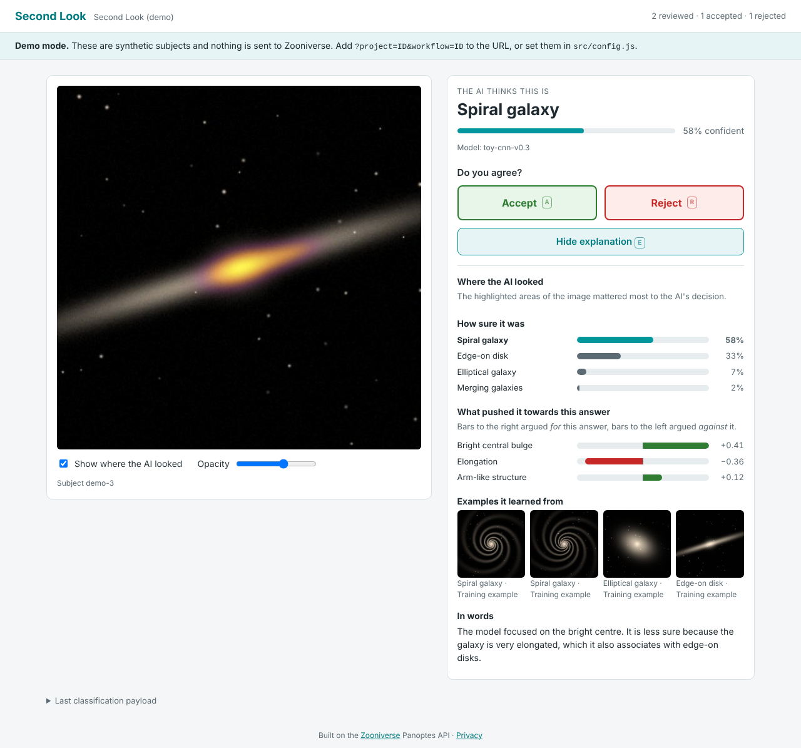

# Second Look

A Zooniverse custom front end where volunteers review an AI's classification
instead of starting from scratch. For each subject the volunteer sees the
model's answer and confidence and can:

- **Accept** it,
- **Reject** it, or
- ask **"Why does the AI think this?"** to see an explanation, then accept or reject.



The explanation is assembled from whichever parts the subject provides:

| Part | What the volunteer sees |
|---|---|
| Saliency map | A heatmap over the image showing where the model looked, with a toggle and an opacity slider |
| Class probabilities | Bars for every class, with the predicted one highlighted |
| Feature attributions | SHAP/LIME-style signed bars: what pushed the model towards or away from its answer |
| Examples | Training images of the predicted and other classes |
| Rationale | A sentence in plain language |

Each decision is sent to Panoptes as an ordinary classification. Metadata
records whether the volunteer opened the explanation, how long they kept it
open, and how long they took to decide, so you can study how explanations
change agreement with the AI.

Volunteers also answer short questionnaires. A few questions on attitudes to
AI come on their first visit, and the Situational Motivation Scale (SIMS) comes
after every fifth classification. See [Questionnaires](#questionnaires).

Like [cosmic-canvas](https://github.com/astrohayley/cosmic-canvas), it has no
build step: static HTML, CSS and ES modules that you can host on GitHub Pages.

## Try it

```bash
npm start            # or: python3 -m http.server 8080
```

Open <http://localhost:8080/>. With no project configured it runs in **demo
mode** with four synthetic galaxies. One AI prediction is deliberately wrong
and one is low-confidence. Nothing is sent to Zooniverse, and the payload that
would have been sent appears under "Last classification payload".

Keyboard: <kbd>A</kbd> accept · <kbd>R</kbd> reject · <kbd>E</kbd> show/hide the explanation.

## Connecting it to a Zooniverse project

### 1. Create the workflow

In the [Project Builder](https://www.zooniverse.org/lab), create a workflow
with one **Question** task (key `T0`, single answer) whose answers are, in
this order:

1. Accept
2. Reject

The annotation value is the answer index (`0` = accept, `1` = reject). If you
use a different task key or answer order, change `CONFIG.task` in
[`src/config.js`](src/config.js). The page shows a warning if the workflow
doesn't have the expected task.

### 2. Upload subjects with AI output in their metadata

The model output travels in **subject metadata**, so all you need is a subject
set. [`scripts/upload_subjects.py`](scripts/upload_subjects.py) uses the
[panoptes-python-client](https://github.com/zooniverse/panoptes-python-client)
to upload a CSV of predictions:

```bash
pip install -r scripts/requirements.txt
python3 scripts/upload_subjects.py scripts/example_predictions.csv --dry-run   # validate only
python3 scripts/upload_subjects.py predictions.csv --project 12345 --workflow 67890 --set-name "Model v1"
```

See [`scripts/example_predictions.csv`](scripts/example_predictions.csv) for the
format. If you upload subjects another way, use these metadata keys. Values are
strings, and structured values are JSON strings. Only `#ai_label` is required.
Subjects without it are skipped.

| Key | Example | Notes |
|---|---|---|
| `#ai_label` | `spiral` | The model's predicted class |
| `#ai_confidence` | `0.91`, `91`, `91%` | Falls back to the label's entry in `#ai_probabilities` |
| `#ai_probabilities` | `{"spiral":0.91,"elliptical":0.09}` | Object or `[{"label","value"}]` list |
| `#ai_saliency` | `1` or `https://…/heat.png` | Index into the subject's `locations`, or a URL. A transparent PNG the same size as the image works best |
| `#ai_features` | `[{"name":"Arms","value":0.6}]` | Signed contributions, largest magnitude first |
| `#ai_examples` | `[{"url":"…","label":"spiral","caption":"…"}]` | Reference images |
| `#ai_rationale` | `Curved arms around a bulge.` | Plain text |
| `#ai_model` | `galaxy-cnn-v2` | Shown under the confidence bar and stored with each classification |

The `#` prefix hides these fields from volunteers in the standard Zooniverse
metadata viewer. Change the keys in `CONFIG.metadataKeys` if needed, and
provide friendly class names in `CONFIG.labelNames`.

### 3. Point the page at the project

Set `projectId` and `workflowId` in [`src/config.js`](src/config.js), or use
URL parameters:

| Parameter | Effect |
|---|---|
| `?project=12345` | Project ID (without one, the page runs in demo mode) |
| `?workflow=67890` | Workflow ID (default: the project's first active workflow) |
| `?env=staging` | Use the Panoptes staging API |
| `?xai=on-request` \| `always` \| `never` | How explanations are offered (see below) |
| `?demo` | Force demo mode |
| `?debug` | Show the classification payload in live mode too |
| `?surveys=off` | Skip both questionnaires for this visit |
| `?reset` | Forget this browser's participant ID, answers and classification count |

### 4. (Optional) Let volunteers sign in

Without sign-in, classifications are anonymous. To credit volunteers, register
an OAuth application on Panoptes and add this page's exact URL as its redirect
URI. Then put the client ID in `CONFIG.oauthClientId`. The page uses the
implicit grant, which works from a static site without a client secret.

### 5. Deploy

Push to GitHub and enable **Settings → Pages → Deploy from a branch** (root of
the branch). `.nojekyll` is already in place.

## What gets recorded

```jsonc
{
  "annotations": [{ "task": "T0", "value": 1 }],      // 0 = accept, 1 = reject
  "metadata": {
    "workflow_version": "7.2", "started_at": "…", "finished_at": "…",
    "user_agent": "…", "user_language": "en-GB", "utc_offset": "0",
    "viewport": { "width": 1280, "height": 900 },
    "source": "second-look",
    "ai_review": {
      "decision": "reject",
      "ai_label": "spiral", "ai_confidence": 0.58, "ai_model": "toy-cnn-v0.3",
      "explanation_mode": "on-request",
      "explanation_available": true,
      "explanation_parts": ["saliency", "probabilities", "features", "examples", "rationale"],
      "explanation_viewed": true,
      "decision_path": "after_explanation",   // or "direct"
      "time_to_decision_ms": 8421,
      "time_to_explanation_ms": 2210,         // null if never opened
      "explanation_dwell_ms": 5873,           // total time the explanation was open
      "events": [                              // up to 50 interactions
        { "type": "explanation_open", "t_ms": 2210 },
        { "type": "heatmap_opacity", "t_ms": 4012, "detail": 0.85 }
      ]
    },
    "participant": {                          // on every classification
      "id": "3f1c…",                          // anonymous, stored in this browser
      "classification_number": 5,             // this volunteer's nth classification
      "skepticism": { "survey": "ai_skepticism", "responses": { … }, "scores": { "skepticism": 4.5 }, … }
    },
    "sims": {                                 // only on every 5th classification
      "survey": "sims", "version": "1", "block": 1,
      "responses": { "q1": 6, "q2": 5, …, "q16": 1 },
      "scores": {
        "intrinsic_motivation": 6.25, "identified_regulation": 5,
        "external_regulation": 2.5, "amotivation": 1.25,
        "self_determination_index": 12.5
      },
      "started_at": "…", "completed_at": "…", "duration_ms": 61234
    }
  },
  "links": { "project": "123", "workflow": "456", "subjects": ["901"] },
  "completed": true
}
```

The AI's label and confidence are copied into each classification. If you
re-upload subjects with a newer model, each classification still shows which
prediction the volunteer was judging.

## Questionnaires

Both questionnaires use 7-point scales and must be fully answered before the
volunteer can continue. They are defined in [`src/surveys.js`](src/surveys.js),
and `CONFIG.surveys` turns them on or off.

**AI skepticism (first visit).** Six items on attitudes to AI in general:
three distrust items and three reverse-keyed trust items. The score is the
mean, and a higher score means more skeptical. The items are adapted from the
Trust in Automated Systems scale (Jian, Bisantz & Drury, 2000) and reworded to
refer to AI rather than a specific system. Replace them with another instrument
if your study calls for one.

**Situational Motivation Scale (every 5th classification).** The 16-item SIMS
(Guay, Vallerand & Blanchard, 2000), stem "Why are you currently engaged in
this activity?". It has four subscales: intrinsic motivation, identified
regulation, external regulation and amotivation. Each subscale score is the
mean of its four items. The self-determination index is
2·IM + IR − ER − 2·AM. The SIMS opens after the volunteer decides on their
5th, 10th, 15th… subject. The answers go in that classification, so they
reach Panoptes together. `CONFIG.surveys.simsEvery` changes the interval.

**Where the answers go.** A static page can only send data to Zooniverse as
classifications, so answers travel in classification metadata (see above).
Each browser gets a random participant ID that links a volunteer's
classifications and answers. The ID is stored in `localStorage` with their
skepticism answers and classification count. The count carries over between
visits, so the SIMS stays on schedule. Clearing site data or switching
browsers starts a new participant. Get informed consent and ethics approval as
your institution requires before collecting survey data.

## Explanation modes

`CONFIG.explanationMode` or `?xai=` sets how explanations are offered:

- `on-request` (default): a "Why?" button. Use it to measure who asks for an explanation and when.
- `always`: the explanation is open from the start.
- `never`: accept/reject only, with no explanation (a control condition).

Every classification records its mode. You can run a between-subjects
comparison by giving different groups different links.

## Development

```bash
npm install
npx playwright install chromium   # or set CHROMIUM_PATH to an existing Chromium
npm test                          # unit + browser tests (Panoptes is mocked)
python3 -m unittest discover tests
python3 scripts/make_demo_images.py   # regenerate the synthetic demo images
```

| Path | Purpose |
|---|---|
| `index.html`, `styles.css` | Page shell and styling |
| `src/config.js` | Everything a project is expected to change |
| `src/app.js` | UI, subject queue and submission flow |
| `src/ai.js` | Reads predictions and explanations from subject metadata |
| `src/classification.js` | Decision/explanation timing and the Panoptes payload |
| `src/panoptes.js` | Panoptes API client and OAuth sign-in |
| `src/surveys.js`, `src/survey-view.js` | Questionnaire items, scoring and form |
| `src/participant.js` | Anonymous participant ID, answers and classification count |
| `src/demo.js`, `demo/` | Offline demo subjects |
| `scripts/` | Subject upload (panoptes-client) and demo image generation |
| `tests/` | `node:test` unit and Playwright browser tests, plus Python tests for the upload script |

## Related

- [cosmic-canvas](https://github.com/astrohayley/cosmic-canvas): no-build brush-tool custom front end (this repo follows its Panoptes/OAuth approach)
- [SJH_IFE_time-distance](https://github.com/somusset/SJH_IFE_time-distance): Streamlit custom front end
- [panoptes-python-client](https://github.com/zooniverse/panoptes-python-client)
